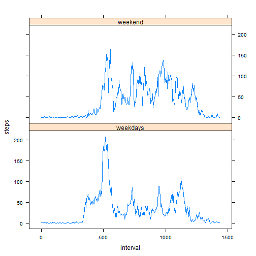

# Reproducible Research: Peer Assessment 1


## Loading and preprocessing the data

We first check the current directory and unzip if necessary.

```r
if(!file.exists("activity.csv") & file.exists("activity.zip")) {
    library(utils)
    unzip("activity.zip")
}
```

We then read in the data file and transform it.

```r
activityData <- read.csv("activity.csv")
activityData$start <- as.POSIXlt(paste0(activityData$date," ",
                                        activityData$interval%/%100,":",
                                        activityData$interval%%100,":00"))
activityData$date <- as.Date(activityData$date)
activityData$day <- weekdays(activityData$date)
activityData$missing <- is.na(activityData$steps)
str(activityData)
```

```
## 'data.frame':	17568 obs. of  6 variables:
##  $ steps   : int  NA NA NA NA NA NA NA NA NA NA ...
##  $ date    : Date, format: "2012-10-01" "2012-10-01" ...
##  $ interval: int  0 5 10 15 20 25 30 35 40 45 ...
##  $ start   : POSIXlt, format: "2012-10-01 00:00:00" "2012-10-01 00:05:00" ...
##  $ day     : chr  "Monday" "Monday" "Monday" "Monday" ...
##  $ missing : logi  TRUE TRUE TRUE TRUE TRUE TRUE ...
```


## What is mean total number of steps taken per day?

We decide not to include the days that have any missing values,
since they may unnecessarily bias other summary statistics.

```r
q1data <- aggregate(activityData$steps,
                    list(activityData$date),
                    sum,na.rm=FALSE)
hist(q1data$x,
     main="Histogram of total steps per day",
     xlab="Steps per day")
```

 

```r
message("The mean number of steps taken per day is ",
        format(mean(q1data$x,na.rm=TRUE),.3,scientific=FALSE), ".")
```

```
## The mean number of steps taken per day is 10766.19.
```

```r
message("The median number of steps taken per day is ",
        median(q1data$x,na.rm=TRUE), ".")
```

```
## The median number of steps taken per day is 10765.
```


## What is the average daily activity pattern?

The average number of steps per 5-min intervals are as follows.

```r
q2data <- aggregate(activityData$steps,
                    list(activityData$interval),
                    mean,na.rm=TRUE)
q2data$Group.1 <- 60*(q2data$Group.1%/%100) + q2data$Group.1%%100
plot(q2data$Group.1,q2data$x,type="l",
     main="Average daily acvitiy pattern",
     xlab="Minutes from 12:00 AM",ylab="Mean steps")
```

 

```r
message("The maximum occurs during 5 mins from ",
        q2data[which.max(q2data$x),1]%/%60, ":",
        q2data[which.max(q2data$x),1]%%60, ".")
```

```
## The maximum occurs during 5 mins from 8:35.
```


## Imputing missing values

The total number of missing values in the dataset is

```r
sum(activityData$missing)
```

```
## [1] 2304
```

However, a more detailed view on the distribution of missing values reveals
that each date's data points are either complete or none.

```r
q3data <- merge(aggregate(activityData$missing,list(activityData$date),sum),
                aggregate(activityData$missing,list(activityData$date),length),
                by="Group.1")
q3data$z <- 100*q3data$x.x/q3data$x.y
q3data$x.x <- NULL
q3data$x.y <- NULL
names(q3data) <- c("date","missing%")
q3data$day <- weekdays(q3data$date)
q3data[q3data$"missing%">0,]
```

```
##          date missing%       day
## 1  2012-10-01      100    Monday
## 8  2012-10-08      100    Monday
## 32 2012-11-01      100  Thursday
## 35 2012-11-04      100    Sunday
## 40 2012-11-09      100    Friday
## 41 2012-11-10      100  Saturday
## 45 2012-11-14      100 Wednesday
## 61 2012-11-30      100    Friday
```

Therefore, we impute the missing value by taking the median value
of the corresponding time slot for the same day of the week.

```r
q3data <- aggregate(activityData$steps,
                    list(activityData$day,activityData$interval),
                    median,na.rm=TRUE)
names(q3data) <- c("day","interval","median")
activityData2 <- merge(activityData,q3data,by=c("day","interval"))
activityData2 <- activityData2[order(activityData2$date),]
rownames(activityData2) <- NULL
activityData2$steps[activityData2$missing] <- activityData2$median[activityData2$missing]
activityData2$median <- NULL
activityData2 <- activityData2[,c(3,4,2,5)]
```

If we repeate the very first step using this imputed dataset,
we get the following results.

```r
q3data <- aggregate(activityData2$steps,
                    list(activityData2$date),
                    sum)
hist(q3data$x,
     main="Histogram of total steps per day",
     xlab="Steps per day")
```

 

```r
message("The mean number of steps taken per day is ",
        format(mean(q3data$x),.3,scientific=FALSE), ".")
```

```
## The mean number of steps taken per day is 9705.238.
```

```r
message("The median number of steps taken per day is ",
        median(q3data$x), ".")
```

```
## The median number of steps taken per day is 10395.
```
We can observe that the distribution has a fatter left tail,
thus the mean and median values are decreased by the imputation.


## Are there differences in activity patterns between weekdays and weekends?

We first create a new factor variable in the imputed dataset
with two levels - "weekday" and "weekend"
indicating whether a given date is a weekday or weekend day.

```r
activityData2$workweek <- "weekdays"
activityData2$workweek[weekdays(activityData2$date) %in% c("Saturday","Sunday")] <- "weekend"
activityData2$workweek <- factor(activityData2$workweek)
```

Then, we contrast the daily activity between weekdays and weekend days:

```r
q4data <- aggregate(activityData2$steps,
                    list(activityData2$workweek,activityData2$interval),
                    mean,na.rm=TRUE)
q4data$Group.2 <- 60*(q4data$Group.2%/%100) + q4data$Group.2%%100
names(q4data) <- c("workweek","interval","steps")
library(lattice)
xyplot(steps~interval|workweek,data=q4data,layout=c(1,2),type="l")
```

 

During weekends, the person starts taking steps later in time than weekdays.
In addition, the person remains relatively more active throughout the day
during weekends compared to weekdays.
